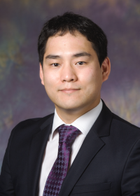

---
title: Jungwook Choi
fontsize: 15pt
---

<!-- Department of Electronic Engineering, Hanyang University -->
Artificial Intelligence Hardware & Algorithms (AIHA) Lab. ([Lab Homepage](https://sites.google.com/view/aihalab){target="blank"})

Department of Electronic Engineering, Hanyang University ([222 Wangsimni-ro, Seongdong-gu, Seoul, South Korea](http://engr.hanyang.ac.kr/eng/about/visit.php){target="blank"}) 

choij@hanyang.ac.kr
<!-- jungwook.m.choi@gmail.com   -->
<!-- img src="email.png" width="200" /-->  

\ 

### News
I am recruiting highly motivated graduate students (MS/PhD programs) with strong research interests in the following topics:

* Compute-efficient deep learning training and inference algorithms (Quantization and Pruning)
* High performance and low power neural processor architecture design and implementation
* Deep learning performance analysis and dataflow/data-reuse optimization software
* Robust deep learning algorithms for in-memory computing (ReRAM and PCRAM)

** Full tuition (+ stipend) support is available for students who apply for the MS-PhD integrated program. **

Please contact me with your CV/Resume if interested!
    
\ 

### Employment and Education

* 2019 - Present: Assistant Professor at [Department of Electronic Engineering](http://electronic.hanyang.ac.kr/en/index.php){target="blank"}, Hanyang University, Seoul, South Korea.
* 2015 - 2019: Research Staff Member at [IBM TJ Watson Research Center](http://www.research.ibm.com/labs/watson/index.shtml){target="blank"}, Yorktown Heights, NY, US.
* 2010 - 2015: Ph.D. at [Electrical and Computer Engineering](https://ece.illinois.edu){target="blank"}, University of Illinois at Urbana-Champaign (Advisor: [Prof. Rob A. Rutenbar](https://www.rutenbar.pitt.edu/){target="blank"})
* 2008 - 2010: M.S. at [Electrical and Computer Engineering](http://ee.snu.ac.kr/en){target="blank"}, Seoul National University (Advisor: [Prof. Wonyong Sung](https://scholar.google.co.kr/citations?user=1IfNFz4AAAAJ&hl=en){target="blank"})
* 2002 - 2008: B.S. at [Electrical Engineering](http://ee.snu.ac.kr/en){target="blank"}, Seoul National University

\ 

### Research Interests

* Artificial intelligence algorithms, accelerator hardware architecture, and performance optimization software
* [AIHA Lab 소개자료](https://github.com/jchoi-hyu/jchoi-hyu.github.io/raw/master/AIHA-%EC%97%B0%EA%B5%AC%EB%82%B4%EC%9A%A9%EC%86%8C%EA%B0%9C%2020200421.pdf){target="blank"}
    
\ 
  
### Research Projects

* 2020 - 2023: 과학기술정보통신부 차세대지능형반도체 기술개발사업 - 2,000 TFLOPS급 서버 인공지능 딥러닝 프로세서 및 모듈 개발
* 2020 - 2024: 과학기술정보통신부 차세대지능형반도체 기술개발사업 - 데이터 재사용 고도화 초저전력 엣지용 딥러닝 프로세서 기술개발  
* 2020 - 2024: 과학기술정보통신부 인공지능대학원 지원사업
* 2020 - 2023: 과학기술정보통신부 시스템반도체융합전문인력육성사업 - 산학 밀착형 IoT 반도체 시스템 융합 인력양성 센터
* 2020 - 2027: 산업통상자원부 산업기술거점센터육성시범사업 - 제조·공정·물류 산업지능화 산업기술거점센터
* 2022 - 2025: 과학기술정보통신부 PIM 인공지능반도체 핵심기술개발사업 - NVM 기반 PIM 반도체 컴퓨팅을 위한 논리합성 SW 개발
* 2022 - 2025: 과학기술정보통신부 PIM 인공지능반도체 핵심기술개발사업 - 엣지용 분산형 온칩메모리-연산기 융합 PIM 반도체 기술개발
* 2023 - 2028: 과학기술정보통신부 인공지능반도체고급인재양성사업 - 인공지능반도체대학원
* 2023 - 2032: 과학기술정보통신부 선도연구센터지원사업 - H3 (극한 스케일-극한 물성-이종 집적) 한계 극복 반도체 기술 연구 센터

\ 

### Publications
<!-- [Jungwook's Google Scholar page](https://scholar.google.com/citations?hl=en&user=YPT98zwAAAAJ&view_op=list_works&sortby=pubdate){target="blank"} -->
[Jungwook's Google Scholar page](https://scholar.google.com/citations?hl=en&user=YPT98zwAAAAJ&view_op=list_works){target="blank"}  

\ 

<!-- ### News
I am recruiting highly motivated graduate students (PhD programs) with strong research interests in the following topics:

* Compute-efficient deep learning training and inference algorithms (Quantization and Pruning)
* High performance and low power neural processor architecture design and implementation
* Deep learning performance analysis and dataflow/data-reuse optimization software
* Robust deep learning algorithms for in-memory computing (ReRAM and PCRAM)

Full tuition (+ stipend) support is available for students who apply for the MS-PhD integrated program.
Please contact me with your CV/Resume if interested! -->
